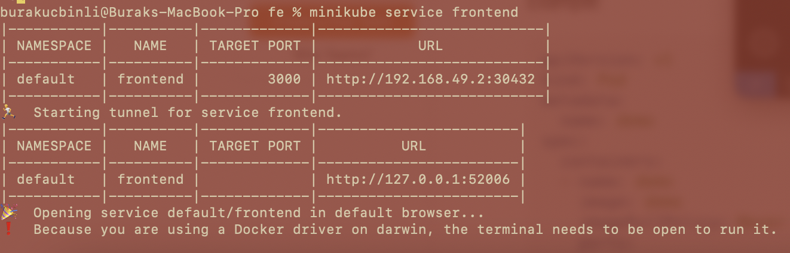

# distributed-test-runner

Scheduling high number of tests to several machines to run them parallelly. Please see the [documentation](documentation/Documentation.md)

# Containerization and K8s

The produced images are not published to any container registry. They will be stored locally. To use these images in local k8s cluster, first we need to build the image in k8s docker environment. Before running build command we need to run `eval $(minikube docker-env)` command to say our Docker daemon to point at our minikube's docker environment. After running this command, now we can build our docker image via `docker build -t dtr-fe .` for our local k8s. Then our deployment will be successful.

## Deploying FrontEnd Image and Access

We have a FrontEnd deployment file in {repository}/k8s/fe folder. We can run `k create -f frontend-deployment.yaml`(k is configured as alias for kubectl in my shell config) command to deploy our FE image to pods(two replicas are set by default). Then we can start its service with `k create -f frontend-service.yaml` command.

#### Warning: Running Service on Mac OS

I'm developing this program in Mac OS with M2 processor. To get the frontend url we run `minikube service frontend --url` but it does not give the url by default because of Docker driver on darwin. So we need to run `minikube service frontend` command which will bind the local port to node's port. See the next image:

