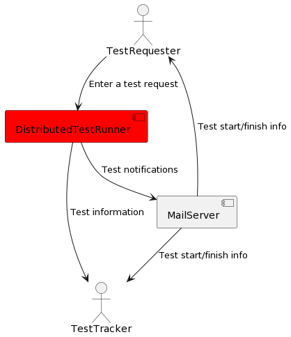
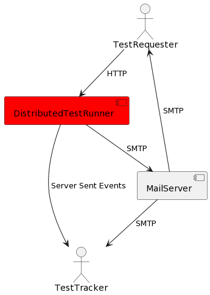
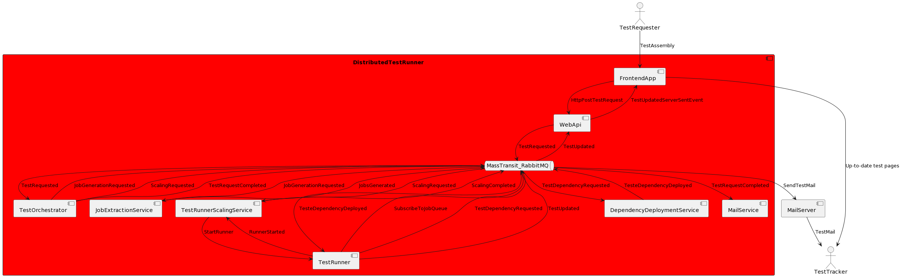

Large enterprise applications can have thousands of test cases. Running hundreds of long running system/integration tests can be time consuming. This project aims to run these tests in parallel within multiple test running agents(e.g. multiple VMs)

In this documentation, arc42 lightweight documentation format is used.

# Introduction and Goals

## Requirements Overview

This chapter summarizes the Distributed Test Runner system requirements. Detailed breakdown is out of scope of this document.

- As a TestRequester I want to upload my test assembly as an archive and run all the tests inside it.
- As a TestRequester I want to be notified by an email when my test run is finished.
- As a TestRequester I want to specify the concurrent test runner count.
- As a TestRequester I want to specify test running strategy as a test-per-runner or test-assembly-per-runner
- As a TestTracker I want to be able to see my requests in Dashboard.
- As a TestTracker I want to be able to see the details of a test run.

## Quality Goals

### Scalability

The system must be scalable in order to hande large number of tests.

### Performance

The system must be able to show the updates in real-time.

### Extensibilty

It must be easy to integrate new test-running-strategies to the system.

## Stakeholders

| Title         | Description                                                                               |
| ------------- | ----------------------------------------------------------------------------------------- |
| TestRequester | A generic role that can request a test run. It can be a developer, tester, architect etc. |
| TestTracker   | A generic role that can view the requested test(s)                                        |

# Constraints

## Technical Constraints

| Id   | Constraint         | Description                                                                                                                                                                                         |
| ---- | ------------------ | --------------------------------------------------------------------------------------------------------------------------------------------------------------------------------------------------- |
| TC01 | frontend framework | There are too much ways to represent the application. Even though it is not a framework, React library will be used to represent the frontend application. It will use MUI as its component library |
| TC02 | backend framework  | ASP.NET(.NET 7) is used to handle the requests                                                                                                                                                      |
| TC03 | communication      | MassTransit with RabbitMQ is used                                                                                                                                                                   |
| TC04 | containerization   | All the components/services must be containerized                                                                                                                                                   |

## Organizational Constraints

Since this is an open source project, open source constraints apply here...

# Scope and Context

## Business Context

## Technical Context

# Solution Strategy

It can be very time consuming to run integration/system tests if you have hundreds of test cases because of their nauture. We can reduce this time to schedule them to several test runners. First we need to identify a test case from a test assembly. Then we need to deploy test dependencies to the related test runner. Then we are ready to run a test case inside the runner. After a test case is finished we can publish its results.

This products implemented using web technologies and microservices architecture. Since this is a POC app, everything will be working on a local machine but it will be easy to merge your custom logics into the app via Dependency Injection. Most of the strategies(like scaling stragy, dependency deployment strategy etc.) will be configurable from config files.

Currently the system will get the test assembly, extract NUnit test cases and create a Job Data Transfer Object(DTO) for each test case. It will boot up some test runner instances that will listen a certain JobDto queue. After all jobs are created, they will be enqueued into the queue and the runners will run the tests as competing-consumers manner.

Test/Job updates will be published via messaging queueing system and these updates will be visible on frontend app via server sent events.

# Building Block View

